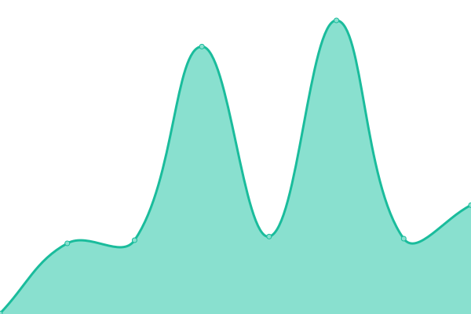

# [📈 Live Status](https://luoxthedev.github.io/statud): <!--live status--> **🟧 Partial outage**

This repository contains the open-source uptime monitor and status page for [Luox](https://replit.com/@luoxthedev), powered by [Upptime](https://github.com/upptime/upptime).

With [Upptime](https://luoxthedev.github.io/status), you can get your own unlimited and free uptime monitor and status page, powered entirely by a GitHub repository. We use [Issues](https://github.com/luoxthedev/status/issues) as incident reports, [Actions](https://github.com/luoxthedev/status/actions) as uptime monitors, and [Pages](https://luoxthedev.github.io/status) for the status page.

<!--start: status pages-->
<!-- This summary is generated by Upptime (https://github.com/upptime/upptime) -->
<!-- Do not edit this manually, your changes will be overwritten -->
<!-- prettier-ignore -->
| URL | Status | History | Response Time | Uptime |
| --- | ------ | ------- | ------------- | ------ |
|  [SilverHost](https://silverhost.fr) | 🟥 Down | [silver-host.yml](https://github.com/luoxthedev/status/commits/HEAD/history/silver-host.yml) | 

 157ms
     
 | 

<a href="https://luoxthedev.github.io/status/history/silver-host">10.38%</a>
    

|  [SilverHost Panel](https://panel.silverhost.fr) | 🟩 Up | [silver-host-panel.yml](https://github.com/luoxthedev/status/commits/HEAD/history/silver-host-panel.yml) | 

 854ms
     
 | 

<a href="https://luoxthedev.github.io/status/history/silver-host-panel">100.00%</a>
    

|  [Google](https://google.fr) | 🟩 Up | [google.yml](https://github.com/luoxthedev/status/commits/HEAD/history/google.yml) | 

 479ms
     
 | 

<a href="https://luoxthedev.github.io/status/history/google">100.00%</a>
    

|  [dsc.gg](https://dsc.gg/silverhost) | 🟥 Down | [dsc-gg.yml](https://github.com/luoxthedev/status/commits/HEAD/history/dsc-gg.yml) | 

 367ms
     
 | 

<a href="https://luoxthedev.github.io/status/history/dsc-gg">9.43%</a>
    

|  [Discord](https://discord.com) | 🟩 Up | [discord.yml](https://github.com/luoxthedev/status/commits/HEAD/history/discord.yml) | 

 154ms
     
 | 

<a href="https://luoxthedev.github.io/status/history/discord">100.00%</a>
    

|  [GitHub](https://github.com) | 🟩 Up | [git-hub.yml](https://github.com/luoxthedev/status/commits/HEAD/history/git-hub.yml) | 

 196ms
     
 | 

<a href="https://luoxthedev.github.io/status/history/git-hub">100.00%</a>
    

<!--end: status pages-->

[**Visit our status website →**](https://luoxthedev.github.io/status)

## 📄 License

- Powered by: [Upptime](https://github.com/upptime/upptime)
- Code: [MIT](./LICENSE) © [Anand Chowdhary](https://anandchowdhary.com), supported by [Pabio](https://pabio.com)
- Data in the `./history` directory: [Open Database License](https://opendatacommons.org/licenses/odbl/1-0/)
